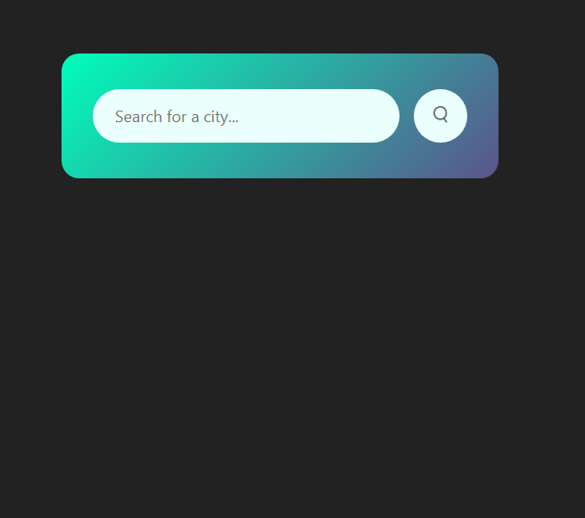
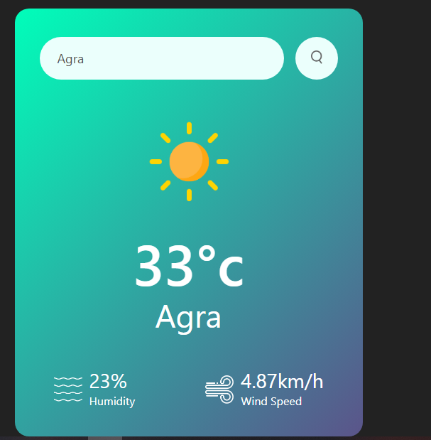

# 🌦️ Weather App

A simple and responsive Weather Application built using **HTML**, **CSS**, and **JavaScript**. This app fetches real-time weather data using a public API and displays the current weather conditions for any city in the world.

## 🌐 Live Demo

👉 [View Live Demo](https://weather-app-004-abhay.netlify.app/)  

## 📸 Preview




## 🚀 Features

- Search weather by city name
- Real-time data fetched from a weather API (e.g., OpenWeatherMap)
- Temperature, humidity, wind speed, and weather condition display
- Responsive UI for mobile and desktop
- Dynamic weather icons

## 🛠️ Tech Stack

- HTML5
- CSS3 (Flexbox/Grid for layout)
- JavaScript (ES6+)
- [OpenWeatherMap API](https://openweathermap.org/api)

## 📦 Setup Instructions

1. **Clone the repository**
   ```bash
   git clone https://github.com/abhay-004/weather-app.git
   cd weather-app
